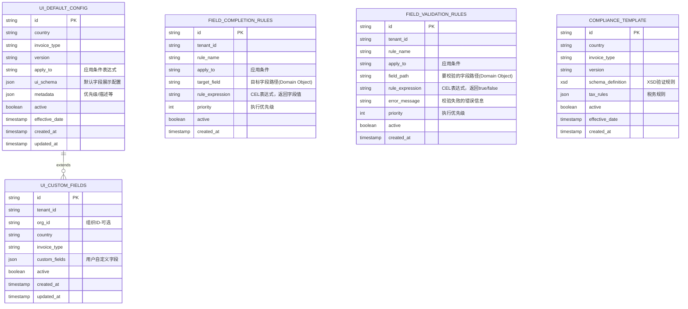

# 下一代开票系统 – 数据架构与规则设计（v0.37）

> 本稿基于 2025‑07‑16 与产品总监的讨论稿，并结合全球发票合规与元数据驱动最佳实践进行全面修订。
> v0.31 更新：将合规校验移至通道层
> v0.33 更新：重组4.1节逻辑实体，按功能分类展示
> v0.34 更新：增加4.1.5基础资料层，明确外部依赖关系
> v0.35 更新：使用CEL (Common Expression Language)替代JSONata作为规则表达式语言
> v0.36 更新：引入Domain Object作为稳定抽象层，集成KDUBL作为核心数据格式
> v0.37 更新：明确系统以KDUBL为核心，引入业务数据网关处理外部系统集成
> 

---

## 目录

1. [业务背景](#1-业务背景)
2. [目标](#2-目标)
3. [执行摘要](#3-执行摘要)
4. [整体架构](#4-整体架构)
   - 4.1 [核心模块](#41-核心模块)
   - 4.2 [模块说明](#42-模块说明)
5. [数据架构](#5-数据架构)
   - 5.1 [逻辑实体](#51-逻辑实体)
   - 5.2 [元数据设计](#52-元数据设计)
6. [实施指南](#6-实施指南)
   - 6.1 [分阶段实施建议](#61-分阶段实施建议)
   - 6.2 [关键成功因素](#62-关键成功因素)
   - 6.3 [规则测试工具](#63-规则测试工具)
7. [AI赋能](#7-ai-赋能)
8. [已解决的澄清点](#8-已解决的澄清点)
9. [附录](#9-附录)

---

## 1. 业务背景

### 1.1 痛点与挑战
开票系统在全球化扩展时面临的核心挑战：
- **硬编码困境**：每新增一个国家/地区，需要大量代码修改，上线周期长达数月
- **合规复杂性**：各国税务法规差异巨大，且频繁变更，维护成本高
- **客户个性化**：不同租户有特殊的业务校验和补全需求，定制开发导致版本分裂
- **运维压力**：变更需要发版，无法快速响应市场变化
- **系统集成复杂**：需要对接多种外部业务系统（ERP、财务、OA等），数据格式各异

### 1.2 业务范围
一个开票系统通常覆盖 **界面、数据存储、业务接口、处理链路** 四大模块。处理链路涵盖合并/拆分、校验、补全、合规文件生成、板式文件生成及交付。

### 1.3 数据流向说明
- **接收端**：从外部业务系统（ERP/财务/OA等）接收多样化格式的业务数据
- **内部处理**：统一使用KDUBL格式进行业务处理
- **发送端**：通过通道层适配各国/协会（如Peppol）的合规格式要求

---

## 2. 目标

- **自适应外部变化**：新增国家、票种、合规规则时，不需改代码，只需通过配置即可完成
- **自适应业务规则变化**：业务数据转换、校验规则、数据补全等通过配置实现
- **智能化运维**：通过AI辅助配置生成、异常检测、性能优化
- **全链路可观测**：配置、规则、状态变化均可追溯
- **灵活集成**：通过业务数据网关支持多种外部系统的数据格式

---

## 3. 执行摘要

### 设计本质
**通过业务数据网关统一外部数据接入，结合"应用条件→执行规则"的元数据驱动架构，实现业务逻辑的配置化管理。**

这个设计包含：
- **业务数据网关**：灵活处理外部系统的多样化数据格式，转换为KDUBL
- **KDUBL核心**：系统内部统一使用KDUBL格式及其转换的Domain Object处理发票数据
- **应用条件** (apply_to)：定义规则何时生效（如国家、发票类型、金额阈值等）
- **执行规则** (rule_expression)：定义要执行的规则（验证、补全、转换等）
- **元数据驱动**：一切皆配置，而非代码
- **配置化管理**：业务逻辑变更通过配置实现，无需修改代码

---

## 4. 整体架构

本方案采用**分层架构**和**规则引擎**设计：

- **技术栈**：使用CEL（Common Expression Language）作为主规则表达式语言，类型安全且高性能；通用的合规校验用xml xsd 和 schema做校验
- **架构特点**：统一业务数据入口，KDUBL为核心格式，业务层与通道层分离，支持私有化部署和公有云混合部署
- **数据模型**：核心字段结构化存储 + KDUBL XML全文存储，兼顾查询性能和数据完整性
- **扩展性**：通过注册自定义函数扩展CEL能力，满足复杂业务场景
- **可观测性**：完整的规则执行日志和状态追踪，便于调试和审计


**说明**

- **业务层**：可部署在私有或公有云
  - **业务连接器**：负责将外部系统数据转换为标准KDUBL格式
  - **KDUBL处理引擎**：系统内部统一使用KDUBL作为标准格式
  - **业务规则引擎**：内存中使用Domain Object执行业务规则
  
- **通道层**：只在公有云，提供统一接口适配 STA / Peppol / 邮件等通道，**负责合规校验**

- **支撑层（配置中心）**：配置 Git‑Ops 化管理，业务层和通道层通过增量拉取获取最新版本

### 4.1 核心模块


### 4.2 模块说明

#### 业务层

- **业务连接器**：接收外部系统（ERP、财务、OA等）的业务数据，转换为标准KDUBL格式
- **KDUBL处理引擎**：系统内部数据标准
  - KDUBL作为持久化和传输格式
  - Domain Object仅在内存中用于业务处理
  - KDUBL ↔ Domain Object转换仅在业务处理时进行
- **界面展示**：支持手工开票，根据配置动态展示字段
- **数据存储**：核心字段（用于查询）+ KDUBL XML全量数据
- **业务接口**：对外提供标准化API接口
- **处理引擎**：聚合层
  - 合并/拆分：按业务规则处理单据
  - **业务校验**：基于Domain Object的字段完整性、业务逻辑校验
  - **补全**：基于Domain Object的字段补全和计算
  - 合规生成：生成标准KDUBL格式
  - 版式生成：生成PDF等格式化文件

#### 通道层

- **合规校验引擎**

  ：验证发票是否符合目标国家/地区的法规要求

  - XSD Schema验证
  - 税务规则验证
  - 格式规范验证

- **交付引擎**：邮件、Peppol网络、API等多种交付方式

> 附录有详述合规校验和业务校验/补全用两种不同机制的原因

------

## 5. 数据架构

### 5.1 逻辑实体

本节介绍系统的数据模型设计，包含以下几类实体：

- **核心业务实体**：开票任务单(INVOICE_TASK)和最终发票(INVOICE)
- **元数据配置实体**：规则配置、合规模板、UI配置等
- **日志与审计实体**：规则执行日志、状态变更日志等
- **交付管理实体**：发票交付记录
- **基础资料层**：外部依赖的主数据系统

#### 5.1.1 核心业务实体

核心业务实体是整个开票流程的主体，负责存储发票的业务数据。


> 这里只是示意图，实际发票任务单可能包含更多字段以及发票行子实体和折扣行子实体，在另一个独立文档做更细化设计（下同）

#### 5.1.2 元数据配置实体

元数据配置实体定义了系统的业务规则、合规模板和UI配置，实现了系统的可配置性。



#### 5.1.3 日志与审计实体

日志实体记录了系统的执行过程和状态变化，支持问题排查、审计追踪和性能分析。


#### 5.1.4 交付管理实体

交付实体负责记录发票的交付过程和结果。


#### 5.1.5 基础资料层（外部依赖）

基础资料是开票系统的数据基础，由于其规模庞大且通常由独立的主数据系统维护，本文档仅描述其与开票系统的接口关系。


##### 设计考虑

1. **稳定策略**：基础资料数据结构，应该作为"single truth"，不可因外部系统不同而变；需定时同步和转换到本系统
2. **缓存策略**：高频访问的基础资料（如税率表）应在本地缓存
3. **降级方案**：基础资料服务不可用时，支持手工输入或使用默认值
4. **版本管理**：基础资料变更时通过版本号确保规则执行的一致性

> **注意**：基础资料系统的具体设计超出本文档范围，此处仅定义接口契约和使用方式。

#### 5.1.6 实体关系总览

下图展示了所有实体之间的完整关系：


> **说明**
>
> - `INVOICE_STATE_LOG` 通过 `entity_type + entity_id` 可同时追踪 `INVOICE_TASK` 与后续 `INVOICE` 的状态演进，一张表即可满足审计与回放需求
> - 新增 `COMPLIANCE_VALIDATION_LOG` 表记录通道层的合规校验结果
> - 简化设计：使用 `FIELD_COMPLETION_RULES` 和 `FIELD_VALIDATION_RULES` 两个专门的表
> - 核心业务表增加了查询字段，实现了核心字段 + 完整KDUBL的混合存储策略

| 实体 (表)                     | 角色 / 用途                                            | 典型写入时机                                                 | 关键字段释义                                                 | 索引 / 约束                                                  | 关注点 / 备注                                                |
| ----------------------------- | ------------------------------------------------------ | ------------------------------------------------------------ | ------------------------------------------------------------ | ------------------------------------------------------------ | ------------------------------------------------------------ |
| **INVOICE_TASK**              | *开票申请单* —— 业务发起者向系统提交的草稿/审批对象    | ① 业务连接器转换后<br>② 补全、校验完成后状态更新             | `invoice_number` 等：查询字段<br>`kdubl_data`：完整 KDUBL XML<br>`connector_type`：来源系统标识 | `id` 主键<br>`(invoice_number)` 索引<br>`(customer_tax_no)` 索引<br>`(invoice_date, total_amount)` 复合索引 | ◆ 混合存储策略<br>◆ 查询字段从KDUBL中提取<br>◆ 数据量大，可按 `created_at` 分区 |
| **INVOICE**                   | *最终发票* —— 法定/可交付票据；申请单成功后生成        | ① 业务校验通过、取得发票号时<br>② 合规校验后状态更新<br>③ 后续作废、红冲时状态变更 | `task_id`：关联 INVOICE_TASK<br>`invoice_number`：官方/税务端号段<br>`compliance_status`：合规状态 | `id` 主键<br>`invoice_number` 唯一索引                       | ◆ 只追加/不可更改原则<br>◆ 同样采用混合存储<br>◆ 合规校验在通道层完成 |
| **COMPLIANCE_VALIDATION_LOG** | 合规校验日志，记录通道层的校验结果                     | 通道层执行合规校验时                                         | `validation_type`：校验类型<br>`validation_result`：校验结果<br>`errors`：详细错误信息 | `(invoice_id, validated_at)` 索引                            | ◆ 用于合规审计追踪<br>◆ 支持重复校验记录                     |
| **INVOICE_STATE_LOG**         | 事件溯源表，记录 INVOICE_TASK 与 INVOICE 的状态跃迁    | 每次状态机从 A→B 时立即追加一条                              | `entity_type`：`INVOICE_TASK` or `INVOICE`<br>`trigger_event`：`SUBMIT` 等<br>`payload`：差异快照或错误详情 | `(entity_type, entity_id, created_at)` 复合索引              | ◆ 只追加、不更新<br>◆ 回放/审计必备                          |
| **RULE_EXECUTION_LOG**        | 规则引擎执行明细，用于调试、追溯和 AI 训练             | 每条规则执行完毕落一条                                       | `input_data`：Domain Object 快照<br>`output_data`：执行结果<br>`execution_result`：`success / failed / skipped`<br>`execution_time_ms`：性能监控 | `(task_id, executed_at)` 索引                                | ◆ 建议冷热分层：近期在线检索，历史归档                       |
| **FIELD_COMPLETION_RULES**    | CEL 补全规则：基于Domain Object的字段补全              | 配置中心 PR 合并后下发                                       | `rule_expression`：CEL 表达式<br>`apply_to`：使用范围条件<br>`target_field`：Domain Object字段路径 | `(tenant_id, active)` 过滤索引                               | ◆ 操作Domain Object<br>◆ 内存中执行                          |
| **FIELD_VALIDATION_RULES**    | CEL 校验规则：基于Domain Object的字段校验              | 配置中心 PR 合并后下发                                       | `rule_expression`：CEL 表达式<br>`apply_to`：使用范围条件<br>`field_path`：Domain Object字段路径 | `(tenant_id, active)` 过滤索引                               | ◆ 操作Domain Object<br>◆ 内存中执行                          |
| **COMPLIANCE_TEMPLATE**       | 合规模板 (XSD + 税务规则)，通道层校验KDUBL是否符合法规 | 根据法规/版本更新<br>或新增国别时导入                        | `schema_definition`：XML XSD<br>`tax_rules`：税务规则JSON<br>`effective_date`：模板生效时间 | `(country, invoice_type, version)` 唯一                      | ◆ 由通道层使用<br>◆ 验证 KDUBL 格式                          |
| **UI_DEFAULT_CONFIG**         | 系统级 UI 基础布局（字段次序、label 等）               | 国别/票种变化或 UI 迭代                                      | `ui_schema`：JSONForm / Formily 等配置<br>`apply_to`：应用条件表达式<br>`metadata`：优先级、描述等 | `(country, invoice_type, version)` 唯一<br>`metadata->>'priority'` 索引 | ◆ 基于KDUBL字段定义<br>◆ 支持条件化UI配置                    |
| **UI_CUSTOM_FIELDS**          | 租户/组织自定义扩展字段                                | 客户管理员配置或 API 导入                                    | `custom_fields`：新增字段定义                                | `(tenant_id, org_id, active)` 索引                           | ◆ 与 `UI_DEFAULT_CONFIG` 合并后渲染前端                      |
| **INVOICE_DELIVERY**          | 发票交付记录（邮件、Peppol、API Pull 等）              | 每次交付动作结束后写入                                       | `delivery_channel`：交付渠道<br>`delivery_status`：`SENT / FAILED …`<br>`delivery_details`：供应商回执等 | `(invoice_id, delivered_at)` 索引                            | ◆ 可多次交付同一发票，保持 1:N 关系                          |

### 建议

1. 监控告警
   - `RULE_EXECUTION_LOG.execution_time_ms` & `INVOICE_DELIVERY.delivery_status` & `COMPLIANCE_VALIDATION_LOG.validation_result` 建议接入 APM，设立 SLA 告警
2. 归档策略
   - 对高频写入的 `INVOICE_STATE_LOG`、`RULE_EXECUTION_LOG`、`COMPLIANCE_VALIDATION_LOG` 建议 2 年冷数据迁往对象存储或数据湖，同时保留索引映射，以支持审计查询
3. 查询优化
   - 基于核心字段的查询直接使用数据库索引
   - 需要完整数据时才解析 `kdubl_data` 字段

> **多租户隔离**：所有业务表带 `tenant_id`，结合行级安全或分区表实现硬隔离。

## 5.2 元数据设计

### 5.2.1 Domain Object设计

#### Domain Object定义

Domain Object是业务层的内存模型，用于业务规则处理，提供类型安全和高性能的操作接口：

```java
// Domain Object 定义 - 仅用于内存中的业务处理
@Data
@Builder
public class InvoiceDomainObject {
    // 基础信息
    private String invoiceNumber;
    private LocalDate issueDate;
    private String invoiceType;
    private String country;
    private String tenantId;
    
    // 供应商信息
    private Party supplier;
    private Party customer;
    
    // 商品明细
    private List<InvoiceItem> items;
    
    // 金额信息
    private BigDecimal totalAmount;
    private BigDecimal taxAmount;
    private BigDecimal netAmount;
    
    // 扩展字段
    private Map<String, Object> extensions;
    
    @Data
    @Builder
    public static class Party {
        private String name;
        private String taxNo;
        private Address address;
        private String email;
        private String phone;
        private String bankAccount;
        private Map<String, Object> extra;
    }
    
    @Data
    @Builder  
    public static class Address {
        private String street;
        private String city;
        private String state;
        private String postalCode;
        private String country;
    }
    
    @Data
    @Builder
    public static class InvoiceItem {
        private String itemId;
        private String description;
        private String productCode;
        private BigDecimal quantity;
        private String unit;
        private BigDecimal unitPrice;
        private BigDecimal amount;
        private BigDecimal taxRate;
        private BigDecimal taxAmount;
        private String taxCategory;
        private Map<String, Object> extra;
    }
}
```

#### 处理流程架构


### 5.2.2 KDUBL与Domain Object转换

#### KDUBL解析器和构建器

```java
/**
 * KDUBL与Domain Object转换器
 * 纯内存操作，仅在业务处理时使用
 */
@Component
public class KDUBLDomainConverter {
    
    /**
     * KDUBL -> Domain Object
     * 用于业务规则处理前的数据准备
     */
    public InvoiceDomainObject parse(String kdubl) {
        Document doc = parseXML(kdubl);
        
        return InvoiceDomainObject.builder()
            .invoiceNumber(extractByXPath(doc, "//cbc:ID"))
            .issueDate(parseDate(extractByXPath(doc, "//cbc:IssueDate")))
            .invoiceType(extractByXPath(doc, "//cbc:InvoiceTypeCode"))
            .supplier(extractParty(doc, "//cac:AccountingSupplierParty"))
            .customer(extractParty(doc, "//cac:AccountingCustomerParty"))
            .items(extractItems(doc))
            .totalAmount(extractAmount(doc, "//cac:LegalMonetaryTotal/cbc:TaxInclusiveAmount"))
            .taxAmount(extractAmount(doc, "//cac:TaxTotal/cbc:TaxAmount"))
            .netAmount(extractAmount(doc, "//cac:LegalMonetaryTotal/cbc:TaxExclusiveAmount"))
            .build();
    }
    
    /**
     * Domain Object -> KDUBL
     * 业务规则处理后生成标准格式
     */
    public String build(InvoiceDomainObject domain) {
        Document doc = createKDUBLTemplate();
        
        // 基础信息
        setXPathValue(doc, "//cbc:ID", domain.getInvoiceNumber());
        setXPathValue(doc, "//cbc:IssueDate", formatDate(domain.getIssueDate()));
        setXPathValue(doc, "//cbc:InvoiceTypeCode", domain.getInvoiceType());
        
        // 参与方信息
        setParty(doc, "//cac:AccountingSupplierParty", domain.getSupplier());
        setParty(doc, "//cac:AccountingCustomerParty", domain.getCustomer());
        
        // 商品明细
        setItems(doc, domain.getItems());
        
        // 金额信息
        setAmount(doc, "//cac:LegalMonetaryTotal/cbc:TaxInclusiveAmount", domain.getTotalAmount());
        setAmount(doc, "//cac:TaxTotal/cbc:TaxAmount", domain.getTaxAmount());
        setAmount(doc, "//cac:LegalMonetaryTotal/cbc:TaxExclusiveAmount", domain.getNetAmount());
        
        return serializeXML(doc);
    }
}
```

### 5.2.3 统一规则表达

#### 规则存储架构


#### 基于Domain Object的规则表达

规则直接操作Domain Object，保持简洁和高性能：

```yaml
# 字段校验规则 - 操作Domain Object
field_validation_rules:
  - rule_name: "校验税号格式"
    apply_to: "country='CN'"
    field_path: "customer.taxNo"
    rule_expression: "invoice.customer.taxNo.matches('^[A-Z0-9]{15,20}$')"
    error_message: "税号必须是15-20位字母数字"
    priority: 100
    
  - rule_name: "校验代理人必填"
    apply_to: "supplier.country='DE' AND customer.country='NL'"
    field_path: "extensions.taxAgent"
    rule_expression: "has(invoice.extensions.taxAgent) && invoice.extensions.taxAgent != ''"
    error_message: "德国到荷兰的发票必须填写税务代理人"
    priority: 90

# 字段补全规则示例
field_completion_rules:
  # 简单赋值 - 直接操作Domain Object
  - rule_name: "补全卖方税率"
    apply_to: "country='CN' AND invoiceType='VAT_SPECIAL'"
    target_field: "supplier.taxRate"  # Domain Object路径
    rule_expression: "0.13"
    priority: 100
    
  # 数据库查询补全 - 查询结果赋值给Domain Object
  - rule_name: "补全买方地址"
    apply_to: "country='CN' AND !has(customer.address)"
    target_field: "customer.address"  # Domain Object路径
    rule_expression: |
      db.organization.get(invoice.customer.taxNo).registered_address
    priority: 50
    
  # 混合使用 - 基于Domain Object数据查询，结果赋值回Domain Object
  - rule_name: "补全税务代理人"
    apply_to: "supplier.country='DE' AND customer.country='NL'"
    target_field: "extensions.taxAgent"  # Domain Object路径
    rule_expression: |
      db.tax_agent.find({
        'from_country': invoice.supplier.country,  # 读取Domain Object
        'to_country': invoice.customer.country,     # 读取Domain Object
        'tax_number': invoice.supplier.taxNo        # 读取Domain Object
      })
    priority: 40
    
  # 计算字段
  - rule_name: "计算商品税额"
    apply_to: "country='CN' AND has(invoice.items)"
    target_field: "items[0].taxAmount"
    rule_expression: "invoice.items[0].amount * invoice.items[0].taxRate"
    priority: 60
```

### 5.2.4 完整处理流程

```java
@Service
@Transactional
public class InvoiceProcessingService {
    
    @Autowired
    private KDUBLDomainConverter converter;
    
    @Autowired
    private DataCompletionEngine completion;
    
    @Autowired
    private BusinessValidationEngine validation;
    
    @Autowired
    private InvoiceTaskRepository repository;
    
    /**
     * 处理KDUBL格式的发票数据
     */
    public InvoiceTask processKDUBLInvoice(String kdubl, String sourceSystem) {
        // 1. 解析为Domain Object（内存操作）
        InvoiceDomainObject domain = converter.parse(kdubl);
        
        // 2. 数据补全（基于Domain Object）
        domain = completion.complete(domain);
        
        // 3. 业务校验（基于Domain Object）
        ValidationResult result = validation.validate(domain);
        if (!result.isSuccess()) {
            throw new ValidationException(result.getErrors());
        }
        
        // 4. 转回KDUBL格式
        String processedKDUBL = converter.build(domain);
        
        // 5. 保存（核心字段 + 完整KDUBL）
        InvoiceTask task = InvoiceTask.builder()
            // 核心字段（从Domain Object提取，用于查询）
            .invoiceNumber(domain.getInvoiceNumber())
            .invoiceDate(domain.getIssueDate())
            .totalAmount(domain.getTotalAmount())
            .taxAmount(domain.getTaxAmount())
            .customerName(domain.getCustomer().getName())
            .customerTaxNo(domain.getCustomer().getTaxNo())
            .supplierName(domain.getSupplier().getName())
            .supplierTaxNo(domain.getSupplier().getTaxNo())
            // 完整数据
            .kdubl(processedKDUBL)
            // 元信息
            .sourceMetadata(Map.of("system", sourceSystem))
            .connectorType(sourceSystem)
            .status("PROCESSED")
            .build();
            
        return repository.save(task);
    }
}

// 规则引擎 - 操作Domain Object
@Component
public class SimpleFieldCompletionEngine {
    
    @Autowired
    private CelEnvironment celEnv;
    
    @Autowired
    private FieldCompletionRuleRepository ruleRepository;
    
    /**
     * 执行字段补全 - 输入输出都是Domain Object
     */
    public InvoiceDomainObject complete(InvoiceDomainObject domain) {
        // 获取适用的补全规则
        List<FieldCompletionRule> rules = ruleRepository
            .findActiveRules(domain.getTenantId())
            .stream()
            .filter(rule -> evaluateCondition(domain, rule.getApplyTo()))
            .sorted(Comparator.comparing(FieldCompletionRule::getPriority))
            .collect(Collectors.toList());
        
        // 逐个执行规则，补全字段
        for (FieldCompletionRule rule : rules) {
            try {
                // 执行CEL表达式，获取字段值
                Object fieldValue = executeExpression(domain, rule.getRuleExpression());
                
                // 设置字段值到Domain Object
                setFieldValue(domain, rule.getTargetField(), fieldValue);
                
                log.debug("字段补全成功: {} = {}", rule.getTargetField(), fieldValue);
            } catch (Exception e) {
                log.error("字段补全失败: {}", rule.getRuleName(), e);
            }
        }
        
        return domain;
    }
}
```

### 5.2.5 查询服务设计

```java
@Repository
public interface InvoiceTaskRepository extends JpaRepository<InvoiceTask, String> {
    
    // 基于核心字段的高效查询
    List<InvoiceTask> findByCustomerTaxNoAndInvoiceDateBetween(
        String taxNo, LocalDate startDate, LocalDate endDate);
    
    // 金额范围查询
    @Query("SELECT i FROM InvoiceTask i WHERE i.totalAmount >= :minAmount")
    List<InvoiceTask> findLargeInvoices(@Param("minAmount") BigDecimal minAmount);
    
    // 复合条件查询
    @Query("SELECT i FROM InvoiceTask i WHERE i.customerName LIKE %:keyword% " +
           "OR i.supplierName LIKE %:keyword% OR i.invoiceNumber = :keyword")
    Page<InvoiceTask> searchInvoices(@Param("keyword") String keyword, Pageable pageable);
}

@Service
public class InvoiceQueryService {
    
    @Autowired
    private InvoiceTaskRepository repository;
    
    @Autowired
    private KDUBLDomainConverter converter;
    
    /**
     * 查询发票列表（只返回核心字段）
     */
    public Page<InvoiceListDTO> searchInvoices(String keyword, Pageable pageable) {
        return repository.searchInvoices(keyword, pageable)
            .map(this::toListDTO);
    }
    
    /**
     * 获取发票详情（解析完整KDUBL）
     */
    public InvoiceDomainObject getInvoiceDetail(String id) {
        InvoiceTask task = repository.findById(id).orElseThrow();
        return converter.parse(task.getKdubl());
    }
    
    private InvoiceListDTO toListDTO(InvoiceTask task) {
        // 只使用核心字段，不解析KDUBL
        return InvoiceListDTO.builder()
            .id(task.getId())
            .invoiceNumber(task.getInvoiceNumber())
            .invoiceDate(task.getInvoiceDate())
            .customerName(task.getCustomerName())
            .totalAmount(task.getTotalAmount())
            .status(task.getStatus())
            .build();
    }
}
```

### 5.2.6 数据补全扩展机制

补全完成本系统目标中，最难的一个模块。因此基于"保持简单"/“单一职责”的原则，系统采用声明式的数据库访问机制来支持灵活的数据补全需求。

> 1. 假设所有补全数据都来自数据库表（且无需通过表关联获取），如果不满足，则应该通过由另外的模块使其满足（宽表等方式）

#### 数据模型声明

通过YAML配置声明可用的数据源，无需编写代码：

```yaml
# data_models.yaml - 数据源声明
data_models:
  # 税务代理人表
  tax_agent:
    table: "master_data.tax_agents"
    key_field: "id"
    search_fields:
      - from_country
      - to_country
      - tax_number
    return_fields:
      - agent_name
      - agent_tax_id
      - agent_address
      - contact_email
    cache_ttl: 3600  # 缓存1小时
  
  # 组织主数据
  organization:
    table: "master_data.organizations"  
    key_field: "tax_number"
    search_fields:
      - tax_number
      - org_name
    return_fields:
      - registered_address
      - legal_name
      - industry_code
    cache_ttl: 86400  # 缓存24小时
```

#### 在补全规则中使用

```yaml
field_completion_rules:
  # 使用db.table.get()获取单条数据
  - rule_name: "补全客户注册地址"
    apply_to: "!has(customer.address)"
    target_field: "customer.address"
    rule_expression: |
      db.organization.get(invoice.customer.taxNo).registered_address
      
  # 使用db.table.find()条件查询
  - rule_name: "补全税务代理人"
    apply_to: "supplier.country='DE' AND customer.country='NL'"
    target_field: "extensions.taxAgent"
    rule_expression: |
      db.tax_agent.find({
        'from_country': invoice.supplier.country,
        'to_country': invoice.customer.country
      }).agent_name
```

#### 实现架构


#### 核心实现(参考)

```java
@Component
public class DatabaseAccessor {
    @Autowired
    private JdbcTemplate jdbc;
    
    @Autowired
    private DataModelRegistry registry;
    
    @Autowired
    private CacheManager cache;
    
    /**
     * 单条查询 - db.table.get(key)
     */
    @Cacheable(value = "db_data", 
               key = "#model + ':get:' + #key",
               condition = "#model.cacheTtl > 0")
    public Map<String, Object> get(String model, Object key) {
        DataModel meta = registry.getModel(model);
        String sql = buildSelectSql(meta, meta.getKeyField() + " = ?");
        
        try {
            return jdbc.queryForMap(sql, key);
        } catch (EmptyResultDataAccessException e) {
            return Collections.emptyMap();
        }
    }
    
    /**
     * 条件查询 - db.table.find(conditions)
     */
    @Cacheable(value = "db_data",
               key = "#model + ':find:' + #conditions.hashCode()",
               condition = "#model.cacheTtl > 0")
    public Map<String, Object> find(String model, Map<String, Object> conditions) {
        DataModel meta = registry.getModel(model);
        
        // 只使用声明的搜索字段
        Map<String, Object> validConditions = conditions.entrySet().stream()
            .filter(e -> meta.getSearchFields().contains(e.getKey()))
            .collect(Collectors.toMap(Map.Entry::getKey, Map.Entry::getValue));
            
        if (validConditions.isEmpty()) {
            throw new IllegalArgumentException("No valid search fields in conditions");
        }
        
        String sql = buildSelectSql(meta, buildWhereClause(validConditions));
        Object[] params = validConditions.values().toArray();
        
        try {
            return jdbc.queryForMap(sql + " LIMIT 1", params);
        } catch (EmptyResultDataAccessException e) {
            return Collections.emptyMap();
        }
    }
    
    private String buildSelectSql(DataModel model, String whereClause) {
        return String.format("SELECT %s FROM %s WHERE %s",
            String.join(",", model.getReturnFields()),
            model.getTable(),
            whereClause
        );
    }
}
```

#### 安全控制

```yaml
# 数据访问控制配置
data_access_control:
  # 全局规则
  global:
    allowed_schemas:
      - "master_data"
      - "reference_data"
    denied_tables:
      - "*.users"
      - "*.passwords"
      - "audit.*"
    
  # 租户级别规则
  tenant_rules:
    - tenant_id: "tenant_123"
      additional_models:
        custom_tax_agent:
          table: "tenant_123.tax_agents"
          inherit_from: "tax_agent"  # 继承标准模型配置
      row_level_filter: "tenant_id = :current_tenant_id"
```

#### 扩展示例

当业务需要新的数据补全时，只需两步：

```yaml
# 步骤1：声明数据模型
data_models:
  industry_tax_config:
    table: "master_data.industry_tax_configs"
    key_field: "industry_code"
    search_fields: 
      - industry_code
      - country
    return_fields:
      - special_requirements
      - tax_exemptions
    cache_ttl: 7200

# 步骤2：在规则中使用
field_completion_rules:
  - rule_name: "补全行业特殊要求"
    apply_to: "has(customer.industryCode)"
    target_field: "extensions.industryRequirements"
    rule_expression: |
      db.industry_tax_config.find({
        'industry_code': invoice.customer.industryCode,
        'country': invoice.country
      }).special_requirements
```

这种设计实现了：

- **零代码扩展**：新数据源通过配置即可使用
- **统一接口**：简洁的db.table.get/find语法
- **性能优化**：内置缓存机制
- **安全可控**：声明式权限管理

### 总结

通过这种设计，我们实现了：

1. **KDUBL作为标准格式**：系统内部统一使用KDUBL，简化了多格式管理
2. **Domain Object用于处理**：提供类型安全、高性能的业务处理能力
3. **混合存储策略**：核心字段支持查询，完整KDUBL保证数据完整性
4. **清晰的职责划分**：业务连接器负责转换，业务层负责处理，通道层负责合规
5. **配置化的规则引擎**：所有业务规则通过CEL表达式配置，操作Domain Object

## 6. 配套工具

### 6.3 规则测试工具

#### 6.3.1 测试工具

```bash
# KDUBL验证
$ invoice-tool validate-kdubl --file invoice.xml
✓ KDUBL schema valid
✓ Required fields present
✓ Business rules passed

# 转换测试
$ invoice-tool test-transform --source erp-data.json --transform cn-vat-transform.yaml
✓ Data transformed successfully
✓ Transformations applied
✓ Output: invoice-kdubl.xml

# 规则测试
$ invoice-tool test-rule --kdubl invoice.xml --rule completion-rules.yaml
✓ Rule conditions evaluated
✓ Completions applied
✓ Output: completed-invoice.xml

# 集成测试
$ invoice-tool test-integration --source ERP --data sample.json
✓ Connection successful
✓ Data parsed
✓ KDUBL generated
✓ Validation passed
```

#### 6.3.2 错误处理策略

```yaml
# 错误处理配置
error_handling:
  integration_errors:
    connection_failed:
      retry_times: 3
      retry_interval: 60s
      fallback: manual_upload
    
    parse_failed:
      log_level: ERROR
      notification: admin
      action: reject
    
    transform_failed:
      log_level: WARN
      action: use_default
      
  validation_errors:
    required_field_missing:
      severity: HIGH
      action: reject
      
    format_invalid:
      severity: MEDIUM
      action: attempt_fix
```


### 6.4 数据模型管理

#### 6.4.1 数据模型配置界面 

系统提供Web界面管理数据模型配置：

```yaml
# 功能列表
data_model_management:
  features:
    - name: "新增数据模型"
      fields:
        - table_name       # 数据表名
        - key_field       # 主键字段
        - search_fields   # 可搜索字段
        - return_fields   # 返回字段
        - cache_ttl       # 缓存时间
        
    - name: "测试查询"
      actions:
        - test_connection  # 测试数据库连接
        - preview_data    # 预览数据
        - test_query      # 测试查询语句
        
    - name: "性能监控"
      metrics:
        - query_count     # 查询次数
        - cache_hit_rate  # 缓存命中率
        - avg_latency     # 平均延迟
```

#### 6.4.2 数据模型测试工具

```bash
# 测试数据模型配置
$ invoice-tool test-model --config tax_agent.yaml
✓ Table 'master_data.tax_agents' exists
✓ All declared fields exist
✓ Key field 'id' has unique index
✓ Sample query executed successfully

# 测试数据查询
$ invoice-tool test-query --model tax_agent --method get --key "AGT001"
✓ Query executed in 23ms
✓ Result:
  {
    "agent_name": "Dutch Tax Services B.V.",
    "agent_tax_id": "NL123456789B01",
    "agent_address": "Amsterdam, Netherlands",
    "contact_email": "info@dts.nl"
  }

# 测试补全规则中的数据访问
$ invoice-tool test-completion --rule "补全税务代理人" --invoice sample.xml
✓ Rule condition matched
✓ Database query: db.tax_agent.find({'from_country': 'DE', 'to_country': 'NL'})
✓ Query result found
✓ Field 'extensions.taxAgent' populated with 'Dutch Tax Services B.V.'
```

## 7. AI 赋能

| 场景         | 方法                                                         |
| ------------ | ------------------------------------------------------------ |
| 新系统接入   | AI分析外部系统样本数据 → 自动生成转换配置<br>智能推荐转换规则 |
| 转换优化     | 基于历史转换学习 → 优化转换准确性<br>异常转换检测和修正建议 |
| 规则生成     | 自然语言描述 → CEL/XPath表达式<br>基于KDUBL结构的智能补全 |
| 故障诊断     | 分析集成日志 → 自动诊断问题原因<br>提供修复建议 |
| 合规适配     | 分析各国法规文档 → 生成合规转换规则 |

### 7.1 智能转换生成

```yaml
# AI分析的样本数据
sample_input:
  source: ERP
  data: |
    {
      "invoice": {
        "customer": {
          "name": "ABC公司",
          "taxId": "91310000MA1FL0KP3B"
        },
        "date": "2024-01-15",
        "amount": 11300.00
      }
    }

# AI生成的映射配置
generated_mapping:
  - source_path: $.invoice.customer.name
    kdubl_xpath: //cac:AccountingCustomerParty/cac:Party/cac:PartyName/cbc:Name
    confidence: 0.95
    
  - source_path: $.invoice.customer.taxId
    kdubl_xpath: //cac:AccountingCustomerParty/cac:Party/cac:PartyTaxScheme/cbc:CompanyID
    confidence: 0.98
    
  - source_path: $.invoice.date
    kdubl_xpath: //cbc:IssueDate
    transform_rule: timestamp.parse(source.value, "yyyy-MM-dd")
    confidence: 0.92
```

---

## 8. 已解决的澄清点

| 主题             | 结论                                                         |
| ---------------- | ------------------------------------------------------------ |
| **表达式语言**   | 统一采用 **CEL (Common Expression Language)**，兼顾可读性、类型安全性与性能。 |
| **脚本升级风险** | PR 门禁：CEL 类型检查 + 单元测试 + 影子回放；通过后自动入库。 |
| **多规则冲突**   | 通过 `priority` 及 `conflict_policy` 字段控制。              |
| **核心数据格式** | 系统内部统一使用KDUBL，通过业务数据网关处理外部格式。 |
| **接收端处理**   | 业务数据网关负责转换外部系统数据为KDUBL。 |
| **发送端处理**   | 通道层负责将KDUBL转换为各国合规格式。 |
| **数据补全扩展** | 采用声明式数据模型 + 统一的db.table.get/find接口，通过配置实现零代码扩展。 |
---

## 9. 附录

### 9.1 为什么合规校验直接用XSD验证XML，而业务校验却要转换成对象

其实当前架构是合理的，因为两种校验的本质不同：

#### 1. 合规校验（结构验证）

```xml
<!-- XSD验证的是XML结构是否符合规范 -->
<xsd:element name="Invoice">
    <xsd:complexType>
        <xsd:sequence>
            <xsd:element ref="cbc:ID" minOccurs="1"/>
            <xsd:element ref="cbc:IssueDate" minOccurs="1"/>
            <!-- 必须包含这些元素，且顺序正确 -->
        </xsd:sequence>
    </xsd:complexType>
</xsd:element>
```

- **关注点**：XML结构、元素存在性、数据类型
- **XSD天然适合**：这正是XSD设计的目的

#### 2. 业务校验（逻辑验证）

```java
// 业务规则需要访问和计算数据
if (invoice.getTotalAmount() > 10000 && 
    invoice.getCustomer().getType() == "ENTERPRISE") {
    // 验证税号必填
}
```

- **关注点**：业务逻辑、数据关系、计算规则
- **对象模型天然适合**：需要方法调用、属性访问、类型安全

### 统一方案的问题

如果强行统一，会出现问题：

#### 方案1：全部用XML + XPath

```java
// ❌ 业务规则变得复杂且易错
String rule = "number(//cbc:TaxInclusiveAmount) > 10000 and " +
              "//cac:AccountingCustomerParty/cac:Party/cbc:IndustryClassificationCode = 'ENTERPRISE'";
```

#### 方案2：全部用对象

```java
// ❌ 合规校验失去了XSD的标准化优势
public boolean validateStructure(InvoiceType invoice) {
    // 手工检查每个必填字段？
    if (invoice.getID() == null) return false;
    if (invoice.getIssueDate() == null) return false;
    // ... 重新实现XSD的功能
}
```

## 建议：保持现有架构

当前的分层处理实际上是最优的：


### 架构合理性

1. **职责清晰**：
   - 通道层：保证数据格式符合国际标准
   - 业务层：实现企业特定的业务逻辑
2. **技术适配**：
   - XSD for XML验证（最适合）
   - Object + CEL for 业务逻辑（最适合）
3. **性能考虑**：
   - 合规校验失败可以早期拒绝，不需要解析成对象
   - 只有通过合规校验的才进入业务处理

### 实现优化建议

如果觉得转换成本高，可以考虑：

```java
@Service
public class InvoiceProcessingService {
    
    // 使用缓存的解析器提高性能
    private final ThreadLocal<Unmarshaller> unmarshaller = ThreadLocal.withInitial(...);
    
    @Transactional
    public InvoiceTask processKDUBL(String kdubl) {
        // 只解析一次，后续都用对象
        InvoiceType invoice = unmarshalOnce(kdubl);
        
        // 业务处理
        businessRuleEngine.process(invoice);
        
        // 只在最后序列化一次
        String processedKDUBL = marshalOnce(invoice);
        
        return saveInvoice(invoice, processedKDUBL);
    }
}
```

这样的架构分层实际上遵循了"**用最合适的工具做最合适的事**"的原则。